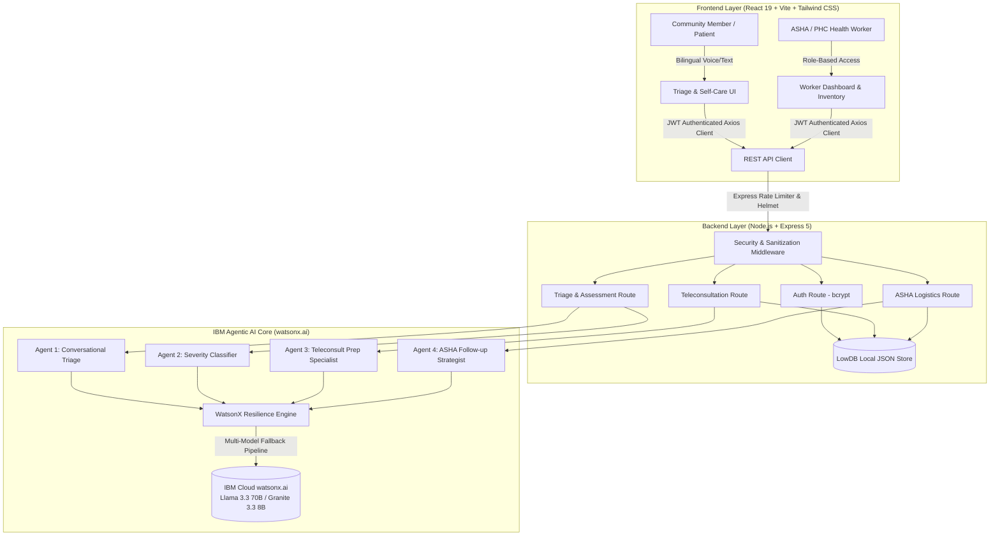

<div align="center">

# 🌿 Vaidi (વૈદ્ય)
### *Intelligent Rural & Tribal Healthcare Access Agent*

[](https://vaidi-agentic-ai-chatboat.onrender.com/)
[](https://www.ibm.com)
[](https://www.ibm.com/watsonx)
[](https://www.ibm.com/granite)
[](https://react.dev)
[](https://nodejs.org)
[](https://tailwindcss.com)
[](https://en.wikipedia.org/wiki/Gujarati_language)

<br/>

**Bridging the last-mile healthcare gap in tribal Gujarat (Dangs, Narmada, and Chhota Udepur) through multi-agent AI triage, teleconsultation scheduling, and frontline health-worker logistics.**

[🚀 Live Demo](https://vaidi-agentic-ai-chatboat.onrender.com/) • [Key Features](#-key-features--design-philosophy) • [System Architecture](#-system-architecture) • [Agent Workflows](#-the-4-specialized-ai-agents) • [Quick Start](#-quick-start) • [Demo Credentials](#-demo-credentials) • [Deployment](#-live-deployment)

---

</div>

## 📌 Executive Summary

Tribal belts across Gujarat—including **The Dangs**, **Narmada**, and **Chhota Udepur**—face acute systemic healthcare challenges:
* **Geographical Isolation:** Extreme travel times and treacherous terrain to reach Primary Health Centers (PHCs) and Community Health Centers (CHCs).
* **Specialist Shortages:** Sparse availability of pediatricians, gynecologists, and general physicians.
* **Frontline Worker Burnout:** Dedicated ASHA and ANM workers are overburdened with manual registers and tracking overdue follow-ups.
* **Language & Digital Literacy Barriers:** Traditional medical interfaces alienate rural speakers who need intuitive interfaces in Gujarati.

**Vaidi** (derived from the Sanskrit *Vaidya*, meaning trusted healer) is a compassionate, agentic healthcare companion. Powered by **IBM watsonx.ai** and state-of-the-art foundation models, Vaidi serves two interconnected personas:
1. **Rural Community Members (Patients):** Voice/text-driven conversational triage, clear color-coded severity grading, local home-care guidance, and doctor slot reservations.
2. **ASHA / PHC Health Workers:** Real-time patient registries, AI-generated visit briefing notes for high-risk cases, and proactive rural dispensary stock tracking.

> [!NOTE]  
> **Hackathon Prototype Notice:** Teleconsultation scheduling, calendar reservations, and stock management are demonstrated with high-fidelity mock data and real-time backend persistence. This application is an assistive triage prototype and is not a replacement for professional emergency medical response.

---

## 🏛 System Architecture



---

## 🤖 The 4 Specialized AI Agents

Vaidi decomposes complex rural clinical workflows into **four decoupled, cooperating AI agents**:

```
┌────────────────────────────────────────────────────────────────────────────────────────┐
│                                   VAIDI AGENT MATRIX                                   │
├──────────────────────────┬──────────────────────────┬──────────────────────────────────┤
│ Agent Name               │ Input Trigger            │ Output & Action                  │
├──────────────────────────┼──────────────────────────┼──────────────────────────────────┤
│ 🩺 Triage Agent          │ User symptom statement   │ Focused, single-question         │
│                          │ (Text / Simulated Voice) │ follow-up in English / Gujarati  │
├──────────────────────────┼──────────────────────────┼──────────────────────────────────┤
│ ⚖️ Severity Classifier   │ Full conversation audit  │ Triage Band (Routine / Attention │
│                          │ trajectory               │ / Urgent) + Bilingual Advice     │
├──────────────────────────┼──────────────────────────┼──────────────────────────────────┤
│ 📅 Teleconsult Prep      │ Urgency band, doctor     │ Pre-consult preparation guide    │
│    Agent                 │ specialty, slot selected │ customized to patient symptoms   │
├──────────────────────────┼──────────────────────────┼──────────────────────────────────┤
│ 📋 ASHA Field Companion  │ Patient medical history, │ Actionable home-visit strategy & │
│    Agent                 │ days overdue, diagnoses  │ red-flag checklist for workers   │
└──────────────────────────┴──────────────────────────┴──────────────────────────────────┘
```

### 1. Conversational Triage Agent
* **Role:** Acts as an empathetic village healthcare worker.
* **Characteristics:** Collects symptoms conversationally without overwhelming patients. Enforces an iterative "one question at a time" protocol.
* **Safety First:** Instantly triggers high-priority **Emergency 108** protocols if life-threatening markers (chest pain radiating to arm, acute breathlessness, sudden paralysis, severe hemorrhage) are detected.

### 2. Clinical Severity & Urgency Agent
* **Role:** Synthesizes the full conversational history into a clear clinical risk profile.
* **Severity Bands:**
  * 🟢 **Routine (સામાન્ય):** Mild conditions manageable via home care and hydration.
  * 🟡 **Needs Attention Soon (ધ્યાન આપવાની જરૂર):** Sub-acute issues warranting teleconsultation or PHC visit within 24–48 hours.
  * 🔴 **Urgent — Seek Immediate Care (તાત્કાલિક સારવાર):** High-risk situations requiring immediate clinical intervention or emergency dispatch.
* **Bilingual Guidance:** Generates plain-language rationale, verified traditional home precautions, and signs of deterioration.

### 3. Teleconsultation Scheduling & Preparation Agent
* **Role:** Connects patients needing attention to simulated specialist doctors (General Medicine, Pediatrics, Obstetrics/Gynecology, Pulmonology).
* **Clinical Preparation:** Generates personalized preparation steps before the call (e.g., measuring fever log, documenting water intake, preparing previous prescriptions).

### 4. Frontline Follow-up & Inventory Agent
* **Role:** Empowers ASHA and Anganwadi workers during village rounds.
* **Follow-up Insights:** Evaluates overdue chronic patients (e.g., Hypertension, Maternal health, Tuberculosis, Anemia) and suggests personalized in-person observation points.
* **Medicine Stock Logistics:** Monitors primary healthcare sub-center inventory (ORS packets, Paracetamol, Iron-Folic Acid, Antibiotics) with automated critical depletion warnings.

---

## ✨ Key Features & Design Philosophy

| Area | Feature Description |
|---|---|
| **🎨 Earth & Heritage Palette** | Grounded in warm terracotta (`#C85A32`), deep forest green (`#2D5A43`), warm sand (`#F9F6F0`), and tribal ochre—eliminating generic cold AI blue/purple templates. |
| **🌐 Native Bilingualism** | Instant one-click toggle between **English** and **Gujarati (ગુજરાતી)** across every button, card, modal, and AI prompt. |
| **🔒 Role-Based Security** | Separate authentication portals for **Community Members** and **ASHA/ANM Health Workers** with encrypted JWT cookies and bcrypt password hashing. |
| **⚡ Multi-Model Resilience** | WatsonX client configured with automatic fallback across models (`meta-llama/llama-3-3-70b-instruct`, `ibm/granite-3-8b-instruct`, `ibm/granite-13b-chat-v2`). |
| **🛡️ Rate Limiting & Sanitation** | Express rate-limiting (15 AI calls/min, 10 auth attempts/15 min) and express-validator payload sanitization. |
| **📱 Mobile-First Responsive** | Optimized for low-bandwidth 4G/3G mobile devices commonly used in rural and tribal districts. |

---

## 📂 Repository Structure

```tree
vaidi/
├── client/                     # Frontend Application (React 19 + Vite)
│   ├── public/                 # Static assets & icons
│   ├── src/
│   │   ├── components/         # Reusable UI components
│   │   │   ├── LanguageToggle.jsx
│   │   │   ├── Layout.jsx
│   │   │   ├── ProtectedRoute.jsx
│   │   │   ├── SeverityBadge.jsx
│   │   │   └── ThinkingIndicator.jsx
│   │   ├── context/            # Global state managers
│   │   │   ├── AuthContext.jsx
│   │   │   └── LanguageContext.jsx
│   │   ├── i18n/               # Translation dictionaries (EN / GU)
│   │   ├── pages/              # Primary application views
│   │   │   ├── FollowupList.jsx
│   │   │   ├── Login.jsx
│   │   │   ├── PatientHome.jsx
│   │   │   ├── SeverityResult.jsx
│   │   │   ├── StockManagement.jsx
│   │   │   ├── Teleconsult.jsx
│   │   │   ├── Triage.jsx
│   │   │   └── WorkerDashboard.jsx
│   │   ├── App.jsx             # Route definitions & guards
│   │   └── main.jsx
│   ├── package.json
│   ├── tailwind.config.js
│   └── vite.config.js
│
├── server/                     # Backend API & AI Core (Node.js + Express)
│   ├── agents/                 # Specialized watsonx.ai Agent Implementations
│   │   ├── followupAgent.js    # ASHA home-visit strategist
│   │   ├── severityAgent.js    # Urgency & severity classification
│   │   ├── teleconsultAgent.js # Doctor matching & pre-consult checklist
│   │   ├── triageAgent.js      # Empathetic symptom conversationalist
│   │   └── watsonxClient.js    # Resilient IBM watsonx SDK bridge
│   ├── db/                     # Local data persistence
│   │   ├── db.json             # Seeded JSON database (users, stock, patients)
│   │   └── index.js
│   ├── middleware/             # Security, JWT auth, and validation
│   ├── routes/                 # REST API endpoints
│   │   ├── auth.js             # Authentication & session verification
│   │   ├── teleconsult.js      # Slot reservation & doctor roster
│   │   ├── triage.js           # Multi-turn triage & evaluation
│   │   └── worker.js           # Dashboard metrics, stock, follow-ups
│   ├── .env.example            # Environment template
│   ├── index.js                # Server entry point & static SPA host
│   └── package.json
│
├── render.yaml                 # Infrastructure as Code for Render Cloud
├── start.bat                   # Single-click launcher for Windows
├── start.sh                    # Single-click launcher for Linux/macOS
└── README.md                   # Project documentation
```

---

## 🚀 Quick Start

### Prerequisites
* **Node.js**: v18.0.0 or higher
* **npm**: v9.0.0 or higher
* **IBM watsonx.ai account**: API Key & Project ID

---

### Step 1: Clone Repository
```bash
git clone https://github.com/SHUBHAM-THAKKAR07/Vaidi---Agentic-AI-CHATBOAT.git
cd Vaidi---Agentic-AI-CHATBOAT
```

---

### Step 2: Environment Configuration
Copy the sample environment file in `server/`:
```bash
# Windows (PowerShell)
Copy-Item server/.env.example server/.env

# Linux / macOS
cp server/.env.example server/.env
```

Open `server/.env` in your editor and configure your credentials:
```ini
# IBM watsonx.ai Configuration
WATSONX_API_KEY=your_ibm_cloud_api_key
WATSONX_PROJECT_ID=your_watsonx_project_id
WATSONX_URL=https://au-syd.ml.cloud.ibm.com
WATSONX_MODEL_ID=meta-llama/llama-3-3-70b-instruct

# Server & Security
PORT=5000
NODE_ENV=development
JWT_SECRET=b63c7ef234098ad8e4b77f198c39d89280a98f7e21
CLIENT_URL=http://localhost:5173
```

> [!TIP]  
> To generate a secure random `JWT_SECRET`, run:  
> `node -e "console.log(require('crypto').randomBytes(32).toString('hex'))"`

---

### Step 3: Automated Launch (Recommended)

#### 🪟 Windows Users:
Double-click `start.bat` or run:
```cmd
start.bat
```

#### 🐧 Linux / macOS Users:
```bash
chmod +x start.sh
./start.sh
```

The script automatically:
1. Verifies that `server/.env` is present.
2. Installs backend dependencies (`server/node_modules`).
3. Installs frontend dependencies (`client/node_modules`).
4. Launches the Express API server on `http://localhost:5000`.
5. Launches the Vite development server on `http://localhost:5173`.

---

### Step 4: Manual Step-by-Step Launch (Alternative)

If you prefer launching individual terminal processes:

```bash
# Terminal 1 — Backend Service
cd server
npm install
npm run dev

# Terminal 2 — Frontend Service
cd client
npm install
npm run dev
```

Visit **`http://localhost:5173`** in your browser.

---

## 🔑 Demo Credentials

Pre-configured demo accounts for evaluating patient and worker experiences:

| Persona | Role | Mobile Number | Password | Capabilities |
|---|---|---|---|---|
| **Ramesh Vasava** | Community Member | `9876543210` | `demo1234` | Symptom triage, Gujarati chat, teleconsult booking |
| **Dakshaben Patel** | Community Member | `9876543211` | `demo1234` | Respiratory symptoms, history review |
| **Geetaben Chaudhari** | ASHA Worker | `9000000001` | `worker123` | Patient follow-up roster, AI visit notes, stock tracking |
| **Pravinbhai Rathwa** | ANM / PHC Worker | `9000000002` | `worker123` | Village health center inventory management |

---

## 📱 User Journeys & Demo Walkthrough

### 🩺 Flow A: Community Member (Patient Experience)
1. **Login & Welcome**: Sign in with phone `9876543210`. The home dashboard greets the patient in Gujarati or English.
2. **Interactive Triage**: Tap **"Start Health Assessment"**.
3. **Conversational Investigation**: Type or speak a concern (e.g., *"મને બે દિવસથી તાવ અને માથાનો દુખાવો છે"* or *"I have had a high fever and headache for 2 days"*).
4. **Adaptive Exploration**: Vaidi asks one focused follow-up question at a time (evaluating chills, cough, rash, stiff neck).
5. **Severity Analysis**: Tap **"Assess My Condition"**. The Severity Agent analyzes the full transcript and displays:
   * Urgency Badge (🟢 Routine / 🟡 Needs Attention / 🔴 Urgent).
   * Plain-language clinical explanation.
   * Tailored home care recommendations & dietary guidance.
6. **Teleconsultation Slot Booking**: For attention-level conditions, choose from available doctors (e.g., Dr. Priya Shah - General Medicine) and confirm a time slot.
7. **Personalized Preparation**: Receive custom AI guidance on what to prepare before the consultation call.

### 📋 Flow B: ASHA Worker (Health Logistics Experience)
1. **Worker Authentication**: Sign in with phone `9000000001`.
2. **Operations Dashboard**: View high-level metrics: total patients under care, overdue follow-ups, and low medicine supplies.
3. **Follow-Up Register**: Navigate to **Follow-Up Register** to inspect rural patients requiring home visits:
   * Filter by status (Overdue / Pending / Completed).
   * Tap **"Get AI Visit Advice"** on a patient card to receive an IBM Granite-generated home inspection brief.
   * Record visit notes and mark patients as visited.
4. **Medicine Stock Management**: Navigate to **Medicine Stock** to view PHC sub-center inventory:
   * View visual indicators for healthy, low, and critical stock.
   * Adjust quantities in real time with quick-action counters.

---

## 🔌 API Reference

### Authentication (`/api/auth`)
* `POST /api/auth/login` — Authenticate patient or health worker, returns JWT token and user profile.
* `GET /api/auth/me` — Retrieve currently authenticated user context via Bearer token.

### Triage & Clinical Assessment (`/api/triage`)
* `POST /api/triage/message` — Submit patient message to the Triage Agent; returns next clinical follow-up question.
* `POST /api/triage/assess` — Trigger the Severity Classifier on the completed conversation; returns severity classification and home-care plan.

### Teleconsultation (`/api/teleconsult`)
* `GET /api/teleconsult/doctors` — List available specialists and schedules.
* `POST /api/teleconsult/book` — Reserve a teleconsultation slot and generate pre-call prep tips.

### Worker Logistics (`/api/worker`)
* `GET /api/worker/dashboard` — High-level summary of overdue visits and inventory alerts.
* `GET /api/worker/followups` — Retrieve patient follow-up register.
* `POST /api/worker/followups/:id/advice` — Generate AI visit guidance for a specific patient.
* `PATCH /api/worker/followups/:id/visited` — Update patient visit status.
* `GET /api/worker/stock` — Fetch current dispensary inventory.
* `PATCH /api/worker/stock/:id` — Update medicine stock count.

---

## 🛡️ Security, Privacy & Safety Controls

* **Zero Secret Exposure**: WatsonX API keys, Project IDs, and JWT secrets are strictly managed through environment variables and excluded via `.gitignore`.
* **Password Encryption**: All passwords hashed using `bcryptjs` with 12 salt rounds.
* **Role-Based Access Control (RBAC)**: Worker routes (`/api/worker/*`) strictly guarded by `verifyToken` and `requireWorker` middleware.
* **Rate Limiting**: Defends against LLM abuse with IP-based and user-based limits (`express-rate-limit`).
* **Input Sanitization**: Request bodies sanitized and validated using `express-validator` to protect against script and query injection.
* **HTTP Security Headers**: Powered by `helmet` to mitigate cross-site scripting (XSS) and clickjacking.

---

## ☁️ Live Deployment

The application is deployed and live on **Render**:

<div align="center">

### 🌐 **Live Application URL**
### 🚀 [https://vaidi-agentic-ai-chatboat.onrender.com/](https://vaidi-agentic-ai-chatboat.onrender.com/)

[](https://vaidi-agentic-ai-chatboat.onrender.com/)

</div>

> [!TIP]  
> You can test both the **Patient Triage flow** and the **ASHA Health Worker dashboard** on the live demo using the [Demo Credentials](#-demo-credentials) (`9876543210` / `demo1234` or `9000000001` / `worker123`).

---

## 💡 Acknowledgements & Attribution

* **IBM SkillsBuild & watsonx Hackathon** — For sponsoring and hosting Challenge 19.
* **IBM watsonx.ai Foundation Models** — Powered by IBM Granite and Meta Llama 3.3 architectures.
* **Gujarat Rural Healthcare System** — Dedicated to the tireless ASHA and Anganwadi workers of Dangs, Narmada, and Chhota Udepur.

---

<div align="center">

**Made with ❤️ for Rural Healthcare Access**  
*Emergency Medical Assistance: Dial 108 (India)*

</div>
